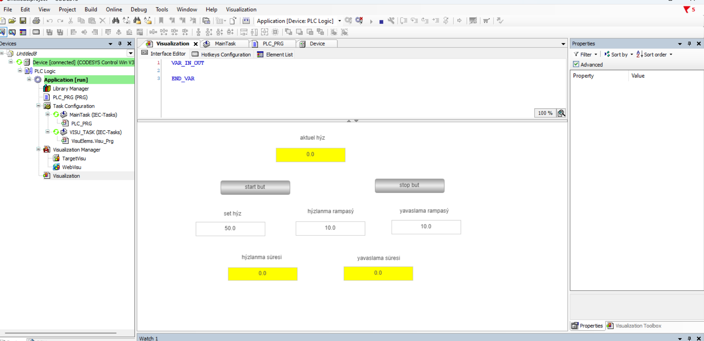

# 🚀 PLC Rampa Algoritması ve HMI Simülasyonu

Bu proje, endüstriyel otomasyon sistemleri için **Structured Text (ST)** kullanılarak yazılmış bir hızlanma ve yavaşlama rampa algoritmasını içermektedir. Projede ayrıca algoritmanın sistem üzerindeki etkilerini gözlemleyebilmek için tasarlanmış bir **HMI arayüzü** ve simülasyon videosu bulunmaktadır.

## 🖥️ HMI Arayüzü
Aşağıda sistemin kontrol edildiği ve anlık hız/ivme değerlerinin izlendiği HMI tasarımı yer almaktadır:

## 🎥 Simülasyon Videosu
Algoritmanın ve arayüzün gerçek zamanlı nasıl çalıştığını görmek için aşağıdaki bağlantıya tıklayabilirsiniz:

👉 [Simülasyon Videosunu İzlemek İçin Tıklayın](HMI_Simulation_Video.mp4)

## ⚙️ Kullanılan Teknolojiler ve İçerik
* **Programlama Dili:** Structured Text (ST)
* **İçerik:** İvme hesaplama, hız limitörleri (LIMIT), zaman bazlı (cyclic) adımlama.

## 📂 Dosya Yapısı
* `Rampa_Algoritmasi.st` : Rampa kontrolünü sağlayan ana ST kodu.
* `HMI_arayuz.png` : Kullanıcı arayüzünün ekran görüntüsü.
* `HMI_Simulation_Video.mp4` : Sistemin çalışmasını gösteren simülasyon kaydı.
* `Ramp_Control_Main.project` : Ana proje dosyası.
